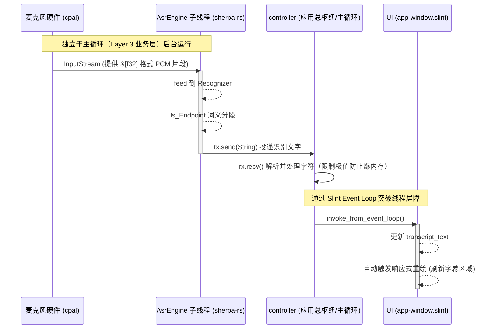

# 模块架构设计：语音感知层 (STT Perception Layer)

这份文档用于记录我们为 `slint_phone` 打造的离线流式语音转文本（STT）架构，方便将来查阅和新进维护者快速理解其中的多线程以及跨端隔离设计。

## 技术选型

* **音频捕获 (Audio Capture)**: `cpal` (跨平台支持 Windows WASAPI / Android Oboe)。
* **语音识别 (ASR 推理引擎)**: `sherpa-rs` (基于新一代 Kaldi 核心的 `sherpa-onnx`)。
* **选用模型**: `sherpa-onnx-streaming-zipformer-bilingual-zh-en` (支持中英双语混合的超低耗端侧模型)。
* **前端展示**: `Slint` UI 框架。

---

## 核心设计准则：MECE 分隔与无阻塞 UI

由于 `Slint` （如同大多数 GUI 框架）的事件循环是在单一主线程中执行的，而**录制声音（阻塞监听）**和**音频解码/神经网络推理**往往是极其吃 CPU 的慢速操作，所以我们绝对不能将识别代码与渲染代码写在一起。

### 系统数据流向图 (Data Flow)

我们使用了 Rust 标准库自带的 `mpsc::channel` 以及 Slint 的 `invoke_from_event_loop` 来完成闭环并解决所有权安全问题。架构图如下：

---

## 本模块落地的各层职责梳理

### 1. 引擎后台：`src/logic.rs` (`AsrEngine`)
这是**纯粹的执行层**。在调用 `start` 后，它会主动通过 `std::thread::spawn` 剥离主线程。
它负责初始化麦克风参数，加载本地的 `onnx` 模型，并通过 `Sender` 不断向外狂灌字符串。它不管是谁接收，也不管用什么 UI 展示，极大地解耦了业务。

### 2. 控制器中继：`src/controller.rs`
这是**跨线程桥接的魔术师**。在这里它实例化了 UI 的弱引用 `ui.as_weak()`，这为了防止闭包生命周期循环引用。
随后在此处开启 Receiver 消费者线程，负责把引擎产生的新文本**追加拼接**。当拼装完成后，**利用 `slint::invoke_from_event_loop` 推送进主事件队列，确保线程安全**。

### 3. 组件显示：`ui/app-window.slint`
这是**最纯粹的表现层**。暴露出简单的 `in-out property <string> transcript_text` 字符串类型让外界修改。由于 Slint 自带响应式系统，任何值的改变都会立刻反映在屏幕底部预留好的文本框位置之中，并带有红色的小跑马指示灯确认状态。

---

## 下一步：Phase 2 路线图预告

* 等待双语模型成功放入 `models/asr` 目录。
* 移除 `logic.rs` 中的 Mock 定时发送机制，启用真正的 `stream.accept_waveform(16000.0, data);` 填充函数。
* 编写 Android 的交叉编译构建脚本 (`build.rs`) 以静态链接/或通过 NDK 提供 `cpal` 以及 C++ 依赖集，真正地将桌面端验证过的逻辑带入移动设备中去！
